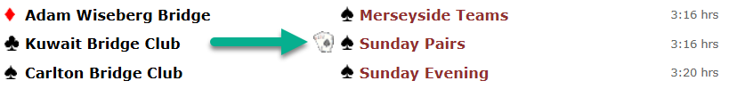


# Kitchen Duplicate Traveler

Play kitchen duplicate bridge and see how your score compares with a tournament! Calculate your match points as if you were at a real club!

**🌐 Try it online:** [https://thestamp.github.io/KitchenDuplicateTraveler/](https://thestamp.github.io/KitchenDuplicateTraveler/)

## What is Kitchen Duplicate Bridge?

Kitchen duplicate bridge is when players at home play the same hands that were dealt at a club or tournament. By using this tool, you can:

- Play a night of Kitchen Bridge, with the competitive scoring of a duplicate tournament!
- Play a board at home and immediately see how your result compares
- Understand if you achieved a good score or if you could have done better
- Learn from seeing what other players bid and made on the same cards
- Practice your bidding and play by analyzing multiple results on each board

## Overview

Kitchen Duplicate Traveler is a tool designed for bridge enthusiasts who play duplicate bridge at home (often called "kitchen duplicate"). This application allows you to:

- **Compare Your Scores**: Take any tournament result from a PBN (Portable Bridge Notation) file and see where your score would have ranked
- **Calculate Match Points**: Find out exactly how many match points you would have earned if you had played in that tournament
- **Learn from Real Games**: Analyze actual hands from club games and understand how different contracts and results affect scoring
- **Practice Scoring**: Perfect for players who want to understand duplicate bridge scoring and match point calculations

## Usage Instructions

### Step-by-Step Guide

#### Method 1: Load from BridgeWebs (Easiest!)

1. **Browse Latest Tournaments**
   - Visit [https://thestamp.github.io/KitchenDuplicateTraveler/](https://thestamp.github.io/KitchenDuplicateTraveler/)
   - Click **"Load Latest Tournaments"** button
   - Search and select from recently completed tournaments worldwide

2. **Select a Tournament**
   - Use the search box to filter by club name or event
   - Click **"Load"** on any tournament to instantly view traveler results
   - The app will automatically fetch and process the PBN file

3. **View Results**
   - Browse the generated traveler sheets showing all board results
   - Click **"View on BridgeWebs"** to see the full tournament rankings
   - Print the sheets for your kitchen duplicate session

#### Method 2: Manual Download from BridgeWebs

1. **Select a Tournament**
   - Go to [BridgeWebs](https://www.bridgewebs.com/cgi-bin/bwor/bw.cgi?club=bw&pid=display_page33) 
   - Select a tournament with the cards icon (indicating downloadable hands)
   - For best results, choose one with at least 5 tables

   

2. **Download the PBN File**
   - Click the **"Hands"** link on the tournament page
   - Download the PBN (Portable Bridge Notation) file

3. **Import to Kitchen Duplicate Traveler**
   - Visit [https://thestamp.github.io/KitchenDuplicateTraveler/](https://thestamp.github.io/KitchenDuplicateTraveler/)
   - Upload the PBN file you downloaded
   - Or paste the PBN file URL directly

#### Method 3: Download from URL

1. **Get the PBN URL**
   - Find a direct link to a PBN file from any bridge scoring software

2. **Paste the URL**
   - Visit [https://thestamp.github.io/KitchenDuplicateTraveler/](https://thestamp.github.io/KitchenDuplicateTraveler/)
   - Paste the URL in the **"Download from URL"** section
   - Click **"Download and Process"**

### Playing Your Kitchen Duplicate

#### 1. Print the Traveler Sheets

Print the generated page. Each page contains 4 boards that can be cut out. 

⚠️ **Important**: Don't look at the hands or scores if you want to play too!

#### 2. Deal the Boards

Use the [BridgeDealer Android app](https://play.google.com/store/apps/details?id=uk.co.jgoacher.iDealer&hl=en) to deal out the boards:

1. Upload the same PBN file to the BridgeDealer app
2. Follow the app's instructions to deal each board
3. Play the hands with your group

#### 3. Score Your Game

After playing each hand, calculate match points based on your results:

- **Match Points** are earned based on how North/South scored on that board compared to other teams in the tournament
- North/South earns the score shown in the **N/S column**
- East/West earns the score shown in the **E/W column**

The higher your match points, the better your result compared to the tournament field!

## Features

- **🌐 Live Tournament Browser**: Instantly browse and load from the latest worldwide BridgeWebs tournaments
- **🔍 Smart Search**: Filter tournaments by club name or event
- **🔗 Direct Links**: View full tournament results on BridgeWebs with one click
- **Automatic Score Calculation**: Uses official duplicate bridge scoring rules to calculate NS (North-South) scores
- **Match Point Calculation**: Accurately computes match points based on comparative scoring
- **Professional Output**: Generates tournament-style traveler sheets showing all results
- **Support for All Contract Types**: Handles regular contracts, doubled, redoubled, and passed hands
- **Vulnerability Aware**: Correctly applies vulnerable/non-vulnerable scoring rules
- **Multiple Import Methods**: Load from BridgeWebs browser, upload files, or paste URLs

## Understanding the Output

The generated traveler sheets show for each board:
- **Contract**: What was bid (e.g., "3NT by S")
- **Tricks**: Number of tricks actually taken
- **Score**: The bridge score for that result (from NS perspective)
- **MP**: Match points earned (based on how this score compares to others)
- **Ranking**: Where this result placed (1st, 2nd, tied, etc.)

## Technology

Web App built with .NET 9 and MudBlazor

Downloadable app built with .NET 8 and QuestPDF for professional PDF generation.

## License

MIT
