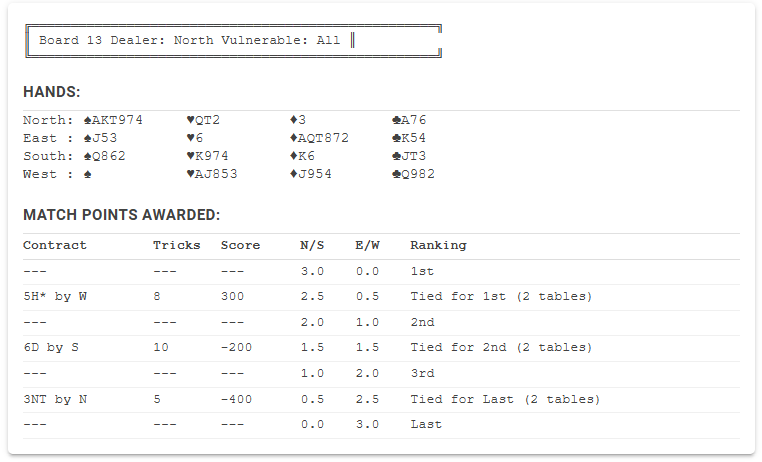

# Kitchen Duplicate Traveler

Play kitchen duplicate bridge and see how your score compares with a tournament! Calculate your match points as if you were at a real club!

**🌐 Try it online:** [https://thestamp.github.io/KitchenDuplicateTraveler/](https://thestamp.github.io/KitchenDuplicateTraveler/)

## Overview

Kitchen Duplicate Traveler is a tool designed for bridge enthusiasts who play duplicate bridge at home (often called "kitchen duplicate"). This application allows you to:

- **Compare Your Scores**: Take any tournament result from a PBN (Portable Bridge Notation) file and see where your score would have ranked
- **Calculate Match Points**: Find out exactly how many match points you would have earned if you had played in that tournament
- **Learn from Real Games**: Analyze actual hands from club games and understand how different contracts and results affect scoring
- **Practice Scoring**: Perfect for players who want to understand duplicate bridge scoring and match point calculations

## How It Works

1. **Get a PBN File**: Obtain a PBN file from a bridge tournament or club game (these files contain deal information and results from all tables)
2. **Process the File**: Drop the PBN file onto the application or enter the file path when prompted
3. **View Results**: The application generates a PDF showing:
   - Each board's hand distribution
   - All contracts played and their results
   - Scores achieved at each table
   - Match points awarded for each score
   - Rankings showing where each result placed

## Features

- **Automatic Score Calculation**: Uses official duplicate bridge scoring rules to calculate NS (North-South) scores
- **Match Point Calculation**: Accurately computes match points based on comparative scoring
- **Professional PDF Output**: Generates tournament-style traveler sheets showing all results
- **Support for All Contract Types**: Handles regular contracts, doubled, redoubled, and passed hands
- **Vulnerability Aware**: Correctly applies vulnerable/non-vulnerable scoring rules

## What is Kitchen Duplicate Bridge?

Kitchen duplicate bridge is when players at home play the same hands that were dealt at a club or tournament. By using this tool, you can:

- Play a board at home and immediately see how your result compares
- Understand if you achieved a good score or if you could have done better
- Learn from seeing what other players bid and made on the same cards
- Practice your bidding and play by analyzing multiple results on each board

## Perfect For

- **Home Bridge Groups**: Players who meet regularly to play duplicate bridge at home
- **Bridge Students**: Learners who want to understand duplicate scoring and match points
- **Tournament Preparation**: Players preparing for club games by studying past results
- **Post-Game Analysis**: Reviewing tournament results to see alternative contracts and outcomes

## Getting Started

### Prerequisites
- .NET 8.0 Runtime

### Usage
1. Run the application
2. When prompted, enter the path to your PBN file (or drag and drop the file onto the executable)
3. The application will process the file and generate a PDF in the same directory
4. Open the PDF to view the complete traveler with all results and match points

## Understanding the Output

The generated PDF shows for each board:
- **Contract**: What was bid (e.g., "3NT by S")
- **Tricks**: Number of tricks actually taken
- **Score**: The bridge score for that result (from NS perspective)
- **MP**: Match points earned (based on how this score compares to others)
- **Ranking**: Where this result placed (1st, 2nd, tied, etc.)

## Technology

Built with .NET 8 and QuestPDF for professional PDF generation.

## License

MIT
